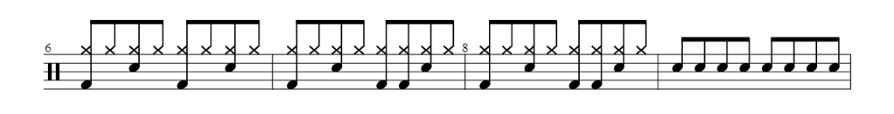

# OMR: Optical Music Recognition

## 📝 Table of Contents

- [Introduction](#Introduction)
- [Dataset](#Dataset)
- [Preparation](#Preparation)
- [Inference](#Inference)
- [Demonstrations](#Demonstrations)
- [References](#References)

## Introduction <a name = "Introduction"></a>

### About OMR
광학 음악 인식(Optical Music Recognition)은 이미지에서 악보를 계산적으로 디코딩하는 방법을 조사하는 연구 분야임.


🔗 [이미지 출처](https://link.springer.com/article/10.1007/s13735-023-00278-5/figures/1)

### In This Project
해당 프로젝트에서는 End-to-End Neural Optical Music Recognition of Monophonic Scores [1] 에서 제안하는 end-to-end 방식으로 작동하는 신경망으로부터 착안하여 구현함.


🔗 [이미지 출처](https://www.mdpi.com/2076-3417/8/4/606)


## Dataset <a name = "Dataset"></a>

#### Input: 악보 이미지 
#### Label:
* Alfaro 가 단일음향 음악을 좌에서 우로 읽는 1차원 시퀀스로 나타내기 위해 제안한 Advance position 방식을 사용
* 해당 방식의 인코딩은 각 차례대로 나타나는 note와 symbol 사이에 '+' 기호를 추가하고, 코드의 개별 음표를 아래에서 위로 순서대로 나열
non-note 음악 기호(clefs, key signatures, time signatures, and barlines)


## Preparation <a name = "Preparation"></a>
```
conda env create --file environment.yaml
```

## Inference <a name = "Inference"></a>
```
python ./ddm-omr/inference.py ./examples/photo1.png
```

## Demonstrations <a name = "Demonstrations"></a>


<div align="center">
 <font size = "70"><h3>Result</h3></font>
</div>
<div align="center">
  <a href="" rel="noopener">
 </a>
</div>
<div align="center">
<table><tr><td >clef-percussion+note-F4_eighth|note-G5_eighth+note-G5_eighth+note-C5_eighth|note-G5_eighth+note-G5_eighth+note-F4_eighth|note-G5_eighth+note-C5_eighth|note-G5_eighth+note-G5_eighth+note-F4_eighth|note-G5_eighth|note-G5_eighth+note-G5_eighth+note-G5_eighth+note-F4_eighth|note-G5_eighth+note-C5_eighth|note-G5_eighth+note-G5_eighth|note-G5_eighth+note-G5_eighth+note-F4_eighth|note-G5_eighth+note-F4_eighth|note-G5_eighth+note-C5_eighth+note-C5_eighth+note-C5_eighth+note-C5_eighth+note-C5_eighth+note-C5_eighth+note-C5_eighth+note-C5_eighth+note-C5_eighth+barline</td></tr></table>​​​​​​​
</div>

## References <a name = "References"></a>
[1] Jorge Calvo-Zaragoza, David Rizo. End-to-End Neural Optical Music Recognition of Monophonic Scores. MDPI, 11 April 2018.
